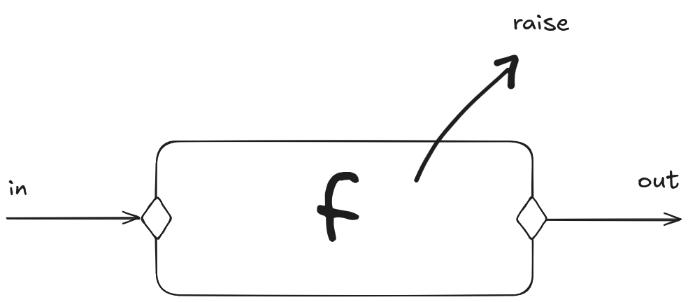

# Aula 04 - Patterns

## Practice Exercises

- **1.** Faça uma função chamada *describe_number* que retorna o nome em string de um número até 5. Retorne "Outro" para números maiores que 6.
- **2.** Faça uma função que retorna a quantidade de elementos de uma lista
- **3.** Faça uma função que retorna o maior elemento de uma lista
- **4.** Faça uma função que retorna o segundo maior elemento de uma lista
- **5.** Faça uma função que entra em um record no formato do exemplo (abaixo) e retorna se a pessoa é maior de idade ou não
- **6.** Altere o type person para incluir o e-mail. Faça uma função para verificar se um e-mail existe ou não no record.
- **7.** Faça uma função que retorne todas as ocorrências de uma lista

## Match

OCaml tem match case. Aplicar como abaixo:

```ocaml
let rec fat n =
    match n with
    | 0 -> 1
    | 1 -> 1
    | n -> n * fat (n-1)
```

Mas esse código tem um problema... E se n for negativo? Stack overflow!

O OCaml usa muito a stack de recursão. Isso não é um problema porque o compilador consegue mudar o tamanho da stack.

Mas como corrigiríamos esse erro?

 - **Sugestão: se for < 0 dar um `raise`.**

Funciona, mas tem um problema. Isso faz a função não ser mais pura! O output passa a "lidar com o mundo externo". A saída não é pelo output, mas por um outro mecanismo (o raise).



Todas as impurezas são controladas pelos "guardiões" na entrada e na saída da função.

Podemos fazer com:

```ocaml
let rec fat = function
    | n when n <= 1 -> 1
    | n -> n * fat (n - 1)
```

## Exceptions

O failwith é uma falha geral, *coisa de preguiçoso*, segundo o Raul. Coisa pra protótipo rápido.

Para capturar o erro, usar try except:

## Pattern Matching

Exercícios da aula:

*1.* Faça uma função chamada *describe_number* que retorna o nome em string de um número até 5. Retorne "Outro" para números maiores que 6.

```ocaml
let describe_number n =
    match n with
    | 1 -> "Um"
    | 2 -> "Dois"
    | 3 -> "Três"
    | 4 -> "Quatro"
    | 5 -> "Cinco"
    | _ -> "Outro"
```

## Constructors

**Não é a mesma coisa que o constructor da orientação a objetos.**. É na verdade a criação de um novo tipo, como se o programassemos no compilador. O mais próximo disso no procedural é o Enum.

```ocaml
type day = Sun | Mon | Tue | Wed | Thu | Fri | Sat =
    match i mod 7 with
    | 0 -> Sun
    | 1 -> Mon
    | 2 -> Tue
    ...
```

Qual a vantagem de fazer isso?

A vantagem é organização. A programação funcional é agradável ao programador - faz mais sentido na cabeça pensar em dias da semana como o tipo dia da semana do que o dia 1, 2, 3, 4...

## Listas

```ocaml
let rec sum_list lst = 
    match lst with
    | [] -> 0 (* lista vazia *)
    | h :: t -> h + sum_list t;;
```

Nesse programa:
 - `h` é de head
 - `t` é de tail
 - `::` é um operador que concatena um elemento a uma lista

`h` e `t` não são caracteres reservados. Você pode chamar do que quiser, mas esse é o tradicional.

### Append (@) e rev

O operador @ faz o append que conhecemos. O problema é que isso não é muito performático. Como é OCaml, o que fazemos é na verdade criar uma nova lista, realocando uma nova fatia de memória.

```ocaml
let my_list = [1; 2; 3] ;;
my_list @ [4] ;;
```

Para grandes listas, tem um truque: usar `rev`.

```ocaml
let append_lst x = List.rev [x :: List.rev lst]
```

O `rev` é um wrapper para uma outra função. Ele não precisa alocar memória, só usa o array original de um outro jeito.

**Atenção!** Listas são diferentes de Arrays. Python que é estranho. Isso quer dizer que não é um espaço contínuo de memória. Pra acessar algum valor, temos quee ir acessando um a um e vendo qual a posição dele na list (*O(n)*)

```ocaml
let x = List.nth [10; 20; 30; 40; 50] 2 (* -> x = 30 *)
```

Por debaixo do capô, o que acontece é o seguinte:

```ocaml
let rec get_element lst idx = 
    match lst with
    | [] -> failwith "Index out of bounds"
    | n :: t -> if idx = 0 then n else get_element t (idx -1)
```

## Record

Record é o equivalente ao dicionário no OCaml.

```ocaml
type person = { name: string, age : int; country : string ; } ;;

let alice = { name = "Alice"; age = 0; country = "Japan" } ;;
```

O mais próximo do que temos disso no Python é o objeto.

De novo, o objeto é mais interessante para a máquina porque o contrato é muito bem estabelecido.

